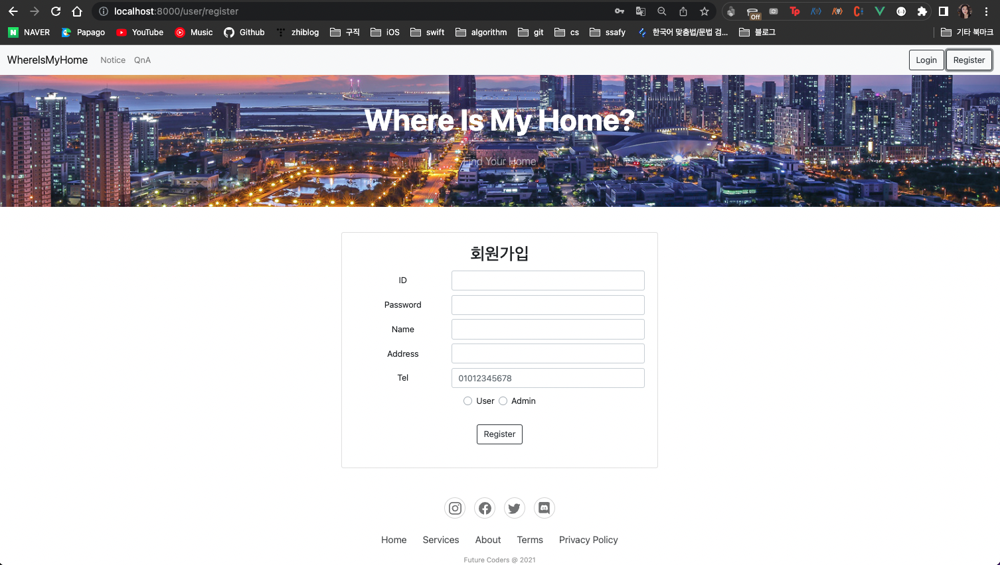

# WhereIsMyHome Final 서울 12반 고태진 김재희

## 진행 사항

### 11월 17일 (목)

1. 구현 기능 정리 및 우선 순위 설정

[FRONT-END]

1. 로그인시 쿠키 전송하도록 cors 처리
2. api, vuex store파일 모듈화
3. 회원가입 페이지 구현

[BACK-END]

1. JWT service 추가

### 11월 18일 (금)

[FRONT-END]

1. 회원가입 비동기 통신
2. 카카오맵 api 연동

[BACK-END]

### 11월 19일 (토)

### 11월 20일 (일)

### 11월 21일 (월)

### 11월 22일 (화)

### 11월 23일 (수)
