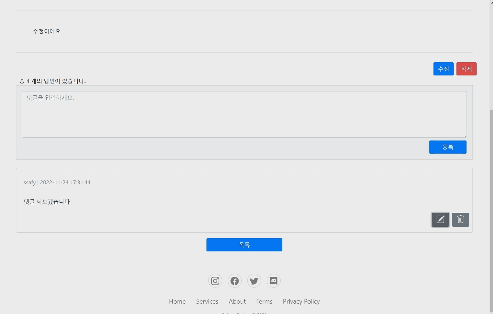
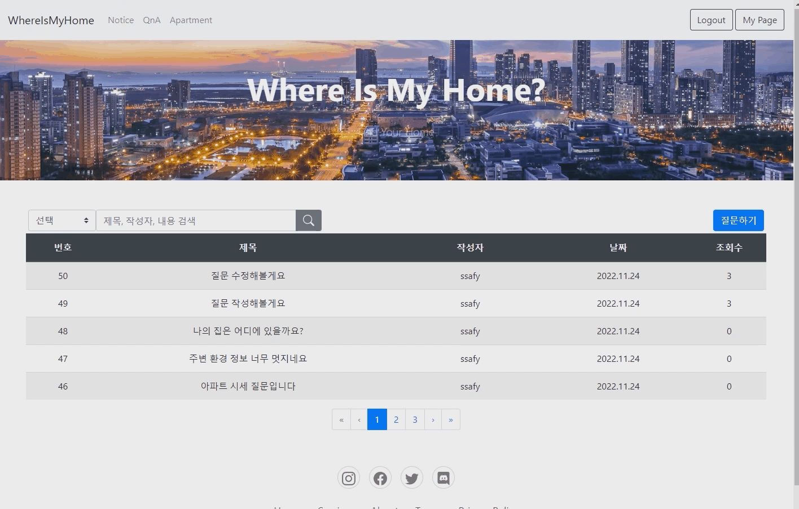

# 🏡 WhereIsMyHome


## 💚 배경 및 개요

국토교통부 아파트 실거래가 데이터를 바탕으로 지도에서 이를 조회하고 주변 상권 정보를 검색할 수 있는 서비스입니다.

### 프로젝트 진행 기간

2022.11.17(목) ~ 2022.11.25(금)

## 💚 핵심 기능

### 홈

- QnA 게시판과 공지사항을 조회하고 작성할 수 있습니다.
- 댓글로 답변 작성을 할 수 있습니다.
- 관련 뉴스 정보를 크롤링하여 주택 관련 최근 뉴스 정보를 제공합니다.

### 주택 실거래가

- 국토교통부 실거래가 정보를 활용하여 데이터 가공 후 유저의 검색 정보에 따라 검색 결과를 제공합니다.

### 주변 정보

- KakaoMap Open API를 활용하여 주변 환경 정보(대형마트, 어린이집, 유치원, 학교, 지하철역, 음식점, 카페, 병원, 약국)를 제공합니다.

### 회원 관리

- 로그인, 로그아웃, 마이페이지 조회, 수정, 회원 탈퇴를 제공합니다.
- 일반 유저, 관리자 로그인 구분합니다.

---

## 💻 주요 기술

### Backend

- JDK 8
- Springboot 2.7.5
- Maven 4.0.0
- Mybatis 2.2.2
- Swagger
- Lombok
- MySQL, Workbench

### Frontend

- VSCode
- Vue 2.7.14
- bootstrap 4.6.1
- vuex 3.6.2
- Node LTS

## 💻 프로젝트 파일 구조

```
  Java
    ├── .mvn
    │   └── wrapper
    └── src
        └── main
            ├── java.com.ssafy.happyhouse
            │   ├── addr
            │   ├── answer
            │   ├── homedeal
            │   ├── news
            │   ├── notice
            │   ├── question
            │   ├── roi
            │   ├── user
            |   |   ├── controller
            |   |   └── model
            |   |       ├── mapper
            |   |       └── service
            │   ├── jwt
            |   |   ├── exception
            |   |   ├── interceptor
            |   |   └── service
            │   ├── config
            │   ├── error
            |   └── util
            └── resources
                └── application.properties

    Vue
    ├── .env
    └── src
        ├── api
        │   └── lib
        ├── assets
        │   ├── apt
        │   ├── marker
        │   └── news
        ├── components
        │   ├── map
        │   ├── notice
        │   ├── qna
        │   └── user
        ├── router
        ├── store
        │   └── modules
        └── views
```

---

## 💚 협업

- GitLab
- 코드 버전 관리

- Notion

  - API 명세 및 진행상황 공유

- MatterMost
  - 협업을 위한 소통

## 💚 팀원 역할

### 김재희

- Frontend: 마이페이지, QnA 게시판
- Backend: DB Table 설계, JWT token login, 주택/회원정보/QnA 게시판 REST API

### 고태진

- Frontend: 메인, 지도(Kakap Map Open API)
- Backend: 뉴스 크롤링, 공지사항 REST API

## 🏡 프로젝트 산출물

- [API명세](https://zhilogs.notion.site/4945d2f2a4354a20a72fad27537c8aee?v=ef42c94901d24c069774aeb5560bef4a)
- [유스케이스다이어그램](./docs/usecase.png)
- [ERD](./docs/erd.png)
- [클래스다이어그램](./docs/class.md)

---

## 💚 시연 영상

### 메인 화면


### 지도


### 유저

회원가입


로그인


로그아웃


#### QnA

글 작성


글 수정


댓글 작성


댓글 수정 및 삭제



글 삭제


검색



#### 공지사항


### 관리자

#### 공지사항

관리자 로그인 후 공지사항 삭제


글 작성


#### 마이페이지

회원정보 수정


