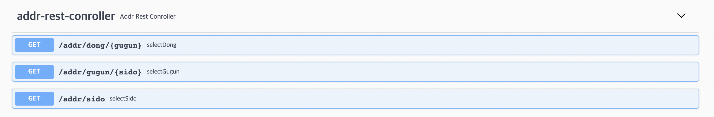
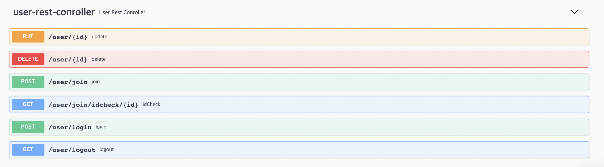
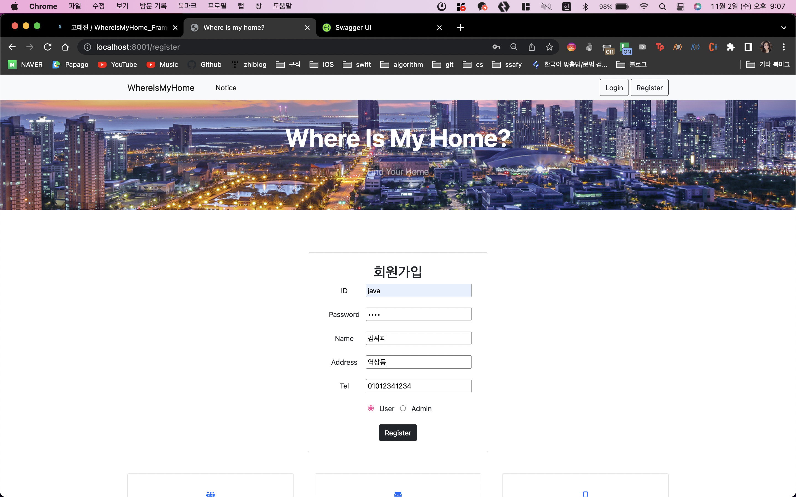
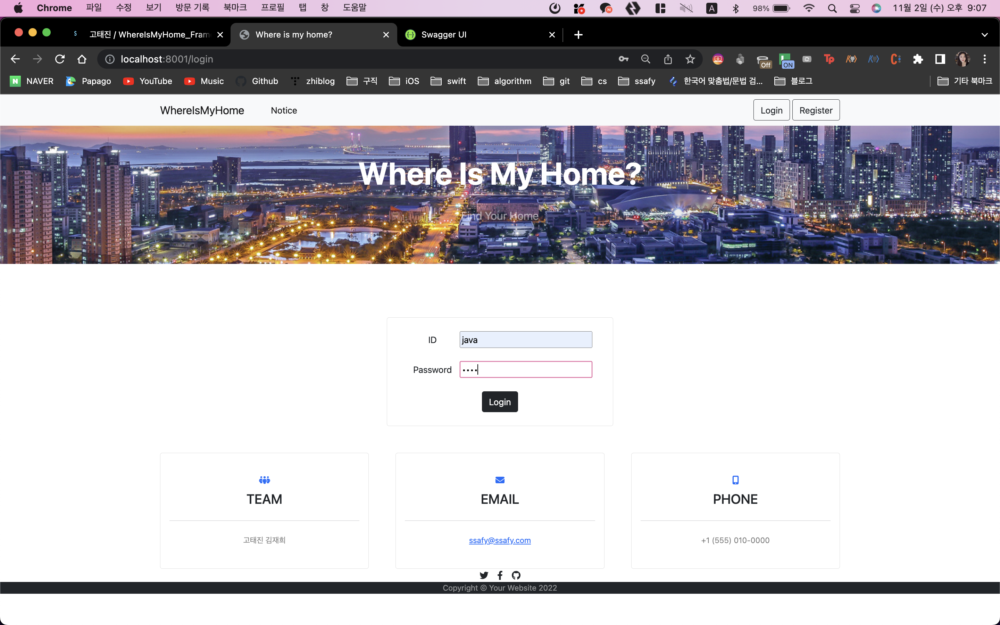
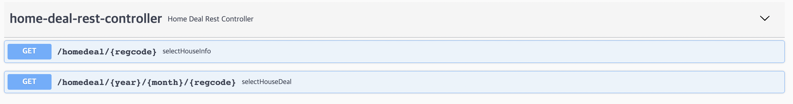
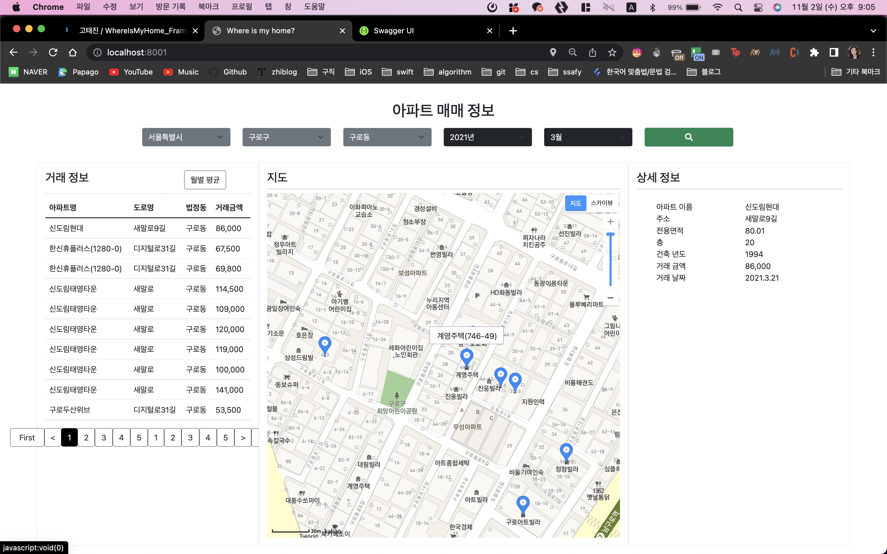
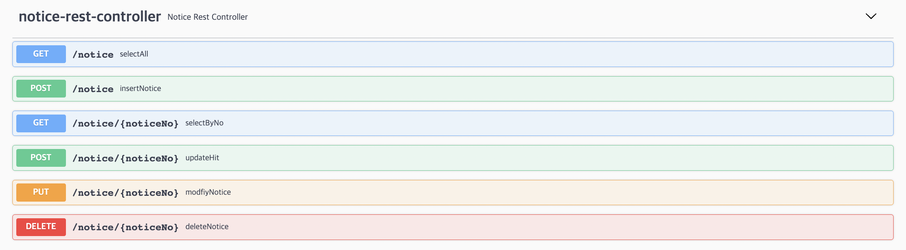

# WhereIsMyHome*Framework*서울*12반*고태진\_김재희

## ① 메인페이지

### ADDR REST API

### 지역 정보 받아오기

#### 시/도

#### 구/군

#### 동

## ② 회원관리(CRUD)작업

### USER REST API

### 회원가입

### 로그인

## ③ 실거래가 검색

### HOMEDEAL REST API

### 검색 후 매매 정보, 지도에 마커 찍기, 상세 정보 보여주기

## 공지사항관리

### NOTICE REST API

